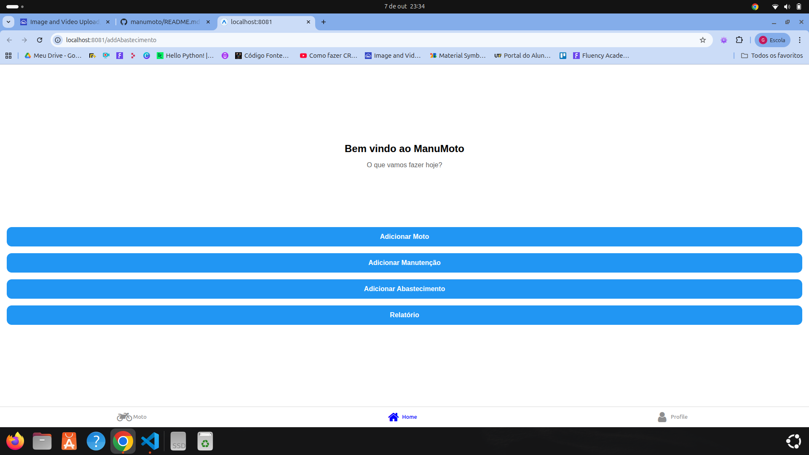
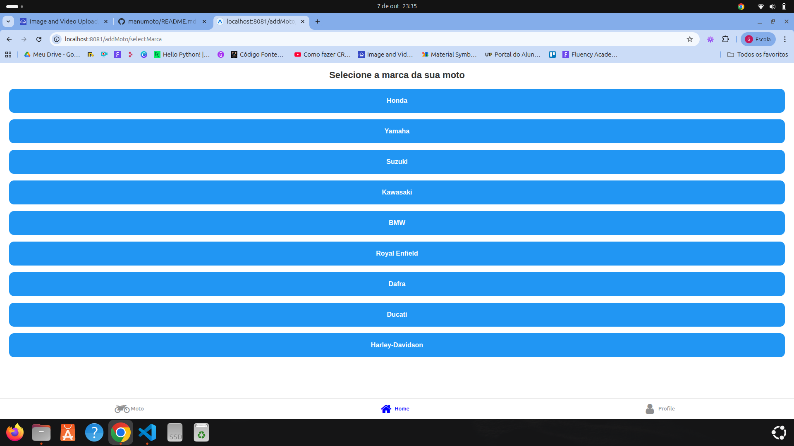
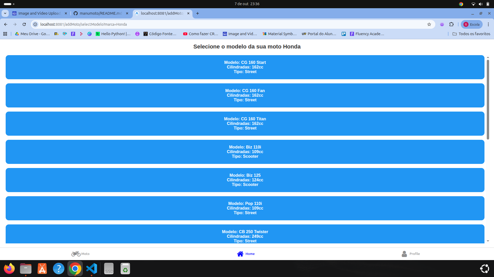
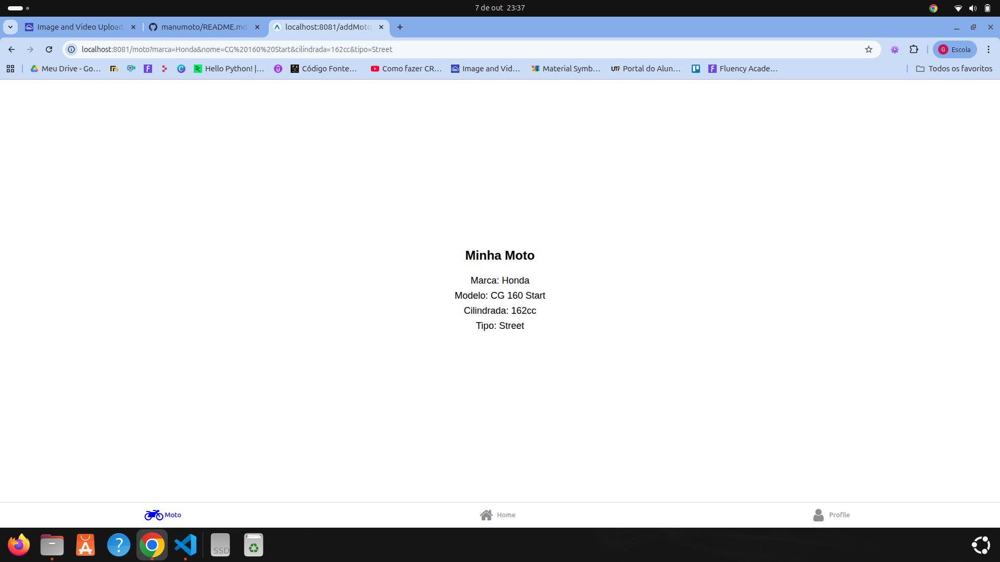
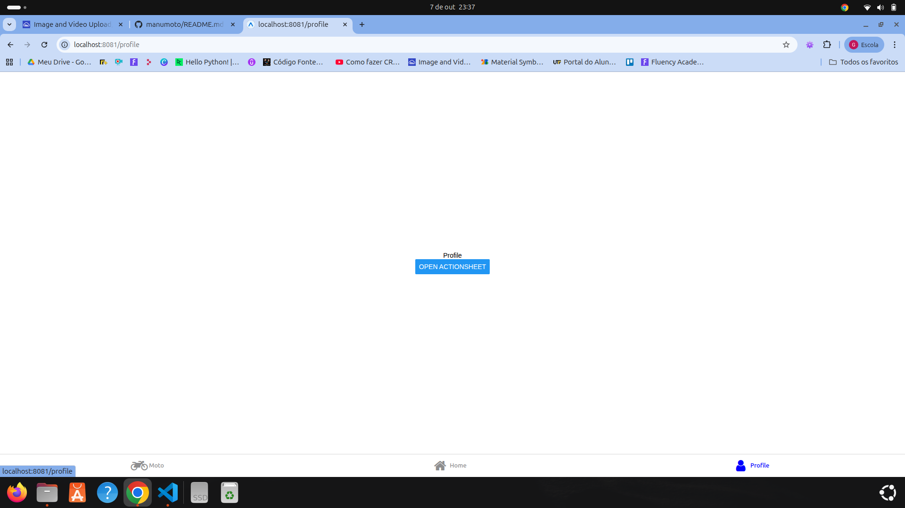
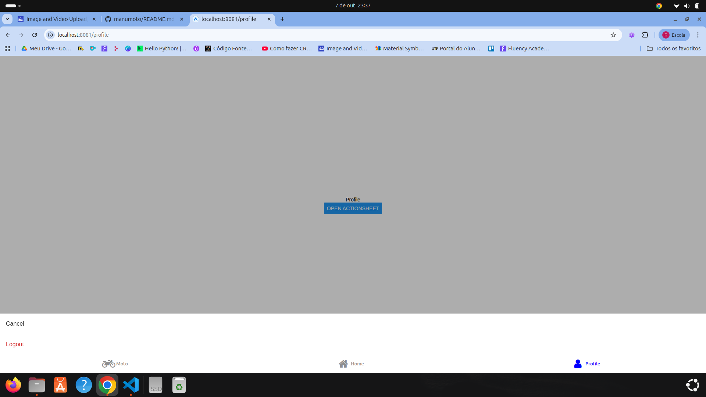

# 🏍️ ManuMoto - Gerenciador de Motos e Manutenções

## 📱 Sobre o Projeto

O **MotoCare** é um aplicativo desenvolvido em **React Native** com **Expo** e **TypeScript**, que tem como objetivo auxiliar o usuário a **registrar e gerenciar informações da sua motocicleta**, incluindo **abastecimentos, manutenções e dados técnicos** do veículo.

O app foi criado como atividade prática da disciplina de **Desenvolvimento Mobile**, para aplicar conceitos de:

- Componentização com React
- Hooks (`useState`, `useEffect`)
- Navegação com **Expo Router**
- Listagens com **FlatList**
- Uso do **ActionSheet**
- Estilização com **StyleSheet**

---

## 🚀 Funcionalidades

- Seleção da **marca e modelo da moto**
- Visualização dos **dados técnicos** da motocicleta
- Registro de **abastecimentos**
- Registro de **manutenções**
- Exibição de **relatórios resumidos**
- Interface moderna e responsiva

---

## 🧩 Estrutura das Telas

| Tela                           | Descrição                                                                                    |
| ------------------------------ | -------------------------------------------------------------------------------------------- |
| **Home**                       | Exibe opções principais do app (Minha Moto, Abastecimento, Manutenção).                      |
| **Seleção de Marca**           | Lista todas as marcas disponíveis com uma FlatList.                                          |
| **Seleção de Modelo**          | Exibe os modelos da marca selecionada, enviando os parâmetros para a tela principal da moto. |
| **Minha Moto**                 | Mostra as informações da moto escolhida (marca, modelo, cilindrada e tipo).                  |
| **Abastecimento / Manutenção** | Formulários para registrar gastos.            |

---

## 🛠️ Tecnologias Utilizadas

- [Expo](https://expo.dev/)
- [React Native](https://reactnative.dev/)
- [TypeScript](https://www.typescriptlang.org/)
- [Expo Router](https://docs.expo.dev/router/introduction/)
- [@expo/react-native-action-sheet](https://docs.expo.dev/versions/latest/sdk/actionsheet/)
- [AsyncStorage (opcional)](https://react-native-async-storage.github.io/async-storage/)

---

## ⚙️ Como Executar o Projeto

### 1️⃣ Clonar o repositório

```bash
git clone https://github.com/SEU-USUARIO/motocare.git](https://github.com/guilhermepatr/manumoto
cd manumoto
```

### 2️⃣ Instalar dependências

```bash
yarn install
```

ou

```bash
npm install
```

### 3️⃣ Criar o template base do projeto com Expo Router

Se ainda não criou o projeto, use o comando:

```bash
npx create-expo-app@latest motocare --template tabs --example with-router
```

> Isso cria o projeto já com o **Expo Router** configurado e abas de navegação prontas.

### 4️⃣ Adicionar a ActionSheet

```bash
yarn add @expo/react-native-action-sheet
```

### 5️⃣ Executar o projeto

```bash
npx expo start
```
ou
```bash
yarn start
```


Abra o app no seu celular com o **Expo Go** ou em um **emulador Android/iOS**.

---

## 🧠 Hooks e Conceitos Aplicados

- `useState` — para estados internos (ex.: seleção de marca e modelo)
- `useEffect` — para carregar dados e sincronizar ações
- `useLocalSearchParams` e `useRouter` — para passagem e leitura de parâmetros entre telas
- `FlatList` — para exibir marcas e modelos
- `ActionSheet` — para exibir opções de ação ao usuário
- `StyleSheet` — para padronizar o layout e cores do app

---

## 🧭 Navegação

O app utiliza o **Expo Router** com a seguinte estrutura de pastas:

```
app/
 ├── (auth)/
 │   ├── marca/
 │   ├── modelo/
 │   ├── moto/
 │   ├── abastecimento/
 │   └── manutencao/
 ├── _layout.tsx
 ├── index.tsx
 └── ...
```

---

## 🎨 Design System

O aplicativo segue uma paleta inspirada em tons de azul e cinza:

| Cor       | Descrição                       |
| --------- | ------------------------------- |
| `#2196f3` | Azul principal (botões e cards) |
| `#3e8ef7` | Azul de destaque                |
| `#f5f5f5` | Fundo claro                     |
| `#333`    | Texto principal                 |

---

## 🖼️ Prints das Telas

| Tela                  | Preview                                  |
| --------------------- | ---------------------------------------- |
| **Home**              |        |
| **Selecionar Marca**  |    |
| **Selecionar Modelo** |  |
| **Minha Moto**        |        |
| **Profile**           |        |
| **Profile Actions**   |        |


---

## 👨‍💻 Autor

Desenvolvido por **Guilherme Patrício Silva**  
📚 Universidade Tecnológica Federal do Paraná — Curso de **Tecnologia em Sistemas para Internet**

---

## 🏁 Licença

Este projeto foi desenvolvido para fins acadêmicos, sem fins comerciais.
